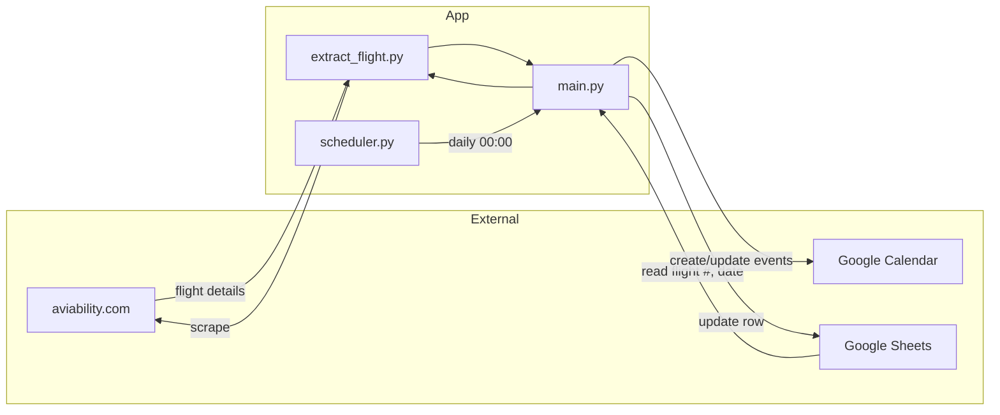

# Flight Calendar Updater

Syncs flight details from a Google Sheet to Google Calendar by scraping flight data from aviability.com.

## Tech Stack

Python 3.12, Google APIs (Sheets v4, Calendar v3), BeautifulSoup4, Poetry

## Architecture



## Prerequisites

- Python 3.12+
- Poetry
- Google Cloud project with:
  - Sheets API enabled
  - Calendar API enabled
  - Service account with JSON key file

## Installation

1. Clone and install:
   ```bash
   git clone https://github.com/momonala/flight-calendar-updater.git
   cd flight-calendar-updater
   poetry install
   ```

2. Set up Google credentials:
   - Create service account in [Google Cloud Console](https://console.cloud.google.com/)
   - Enable Google Sheets API and Google Calendar API
   - Download JSON key → save as `google_application_credentials.json`
   - Share your Google Sheet with the service account email
   - Share your Google Calendar with the service account email

3. Configure `values.py`:
   ```python
   from google.oauth2 import service_account

   SERVICE_ACCOUNT_FILE = "google_application_credentials.json"
   SCOPES = [
       "https://www.googleapis.com/auth/calendar",
       "https://www.googleapis.com/auth/spreadsheets",
   ]

   SPREADSHEET_ID = "<your-spreadsheet-id>"  # REQUIRED: from sheet URL
   RANGE_NAME = "raw!A:ZZ"                   # default: reads all columns
   CALENDAR_ID = "<your-calendar-id>"        # REQUIRED: email or calendar ID
   credentials = service_account.Credentials.from_service_account_file(
       SERVICE_ACCOUNT_FILE, scopes=SCOPES
   )
   ```

## Running

```bash
# One-time run
python main.py

# As daemon (runs daily at midnight)
python scheduler.py
```

## Project Structure

```
flight-calendar-updater/
├── main.py                 # Entry point: orchestrates sheet read → scrape → calendar update
├── extract_flight.py       # Flight scraping & parsing from aviability.com
├── scheduler.py            # Daily cron wrapper using schedule library
├── values.py               # Config: Google credentials, sheet/calendar IDs
├── google_application_credentials.json  # Service account key (not committed)
├── pyproject.toml          # Dependencies
└── install/
    ├── install.sh          # Linux systemd setup script
    └── projects_flight_calendar_updater.service  # systemd unit file
```

## Key Concepts

| Concept | Description |
|---------|-------------|
| `FlightInfo` | Dataclass holding parsed flight data (times, airports, terminals, aircraft) |
| `gcal_event_id` | Sheet column storing Calendar event ID for update vs. create logic |
| Timezone handling | Times are localized using airport IATA codes → `airportsdata` timezone lookup |
| Date formulas | Sheet columns `Date` and `Weekday` use Excel formulas, not raw values |

## Data Flow

1. **Read** — Fetch rows from Google Sheet where `Date` is in the future and `Flight #` exists
2. **Scrape** — POST to `aviability.com/en/flight/` with flight number → parse HTML response
3. **Transform** — Extract airports, times, terminals, aircraft into `FlightInfo`
4. **Calendar** — Create new event or update existing (using `gcal_event_id`)
5. **Write back** — Update sheet row with enriched flight details

## Google Sheet Schema

| Column | Type | Description |
|--------|------|-------------|
| `Year`, `Month`, `Day` | int | Date components for formula |
| `Date` | formula | `=DATE(A, MONTH(B&1), C)` |
| `Weekday` | formula | `=TEXT(Date, "DDD")` |
| `Flight #` | string | e.g., `BA 999`, `LH2206` |
| `gcal_event_id` | string | Populated by script after event creation |
| `Departure Airport`, `Arrival Airport` | string | IATA codes, populated by script |
| `Departure Time`, `Arrival Time` | string | With timezone offset, e.g., `14:30 (CET +1)` |
| `Duration` | string | `HH:MM` format |
| `Origin`, `Destination` | string | City names |
| `airline`, `aircraft` | string | From scrape |
| `departure_terminal`, `arrival_terminal` | string | From scrape |
| `departure_country`, `arrival_country` | string | Country names |

## Deployment (Linux systemd)

```bash
cd install
./install.sh
```

This creates a conda environment, installs dependencies, and enables a systemd service that runs `scheduler.py` continuously.

## External Dependencies

| Service | Usage | Notes |
|---------|-------|-------|
| aviability.com | Flight data scraping | Unofficial, no API key needed |
| Google Sheets API | Read/write flight tracker | Requires service account |
| Google Calendar API | Create/update events | Requires service account |

## Limitations

- Scrapes aviability.com — may break if site structure changes
- Flight lookup requires exact flight number format
- Only processes future flights (past dates are skipped)