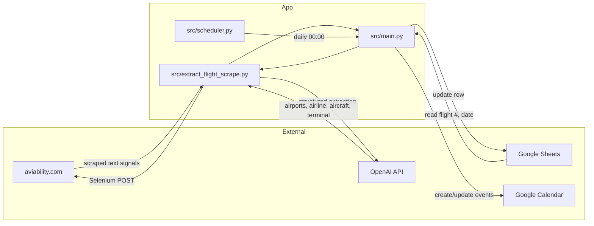

# Flight Calendar Updater

[](https://github.com/momonala/flight-calendar-updater/actions/workflows/ci.yml)
[](https://codecov.io/gh/momonala/flight-calendar-updater)

Syncs flight details from a Google Sheet to Google Calendar. Scrapes live schedule data from aviability.com using Selenium, then uses a lean OpenAI call to extract structured fields from the scraped text — no hallucination, no training-data recall.

## Tech Stack

Python 3.12, Google APIs (Sheets v4, Calendar v3), Selenium, OpenAI, uv

## Architecture


```mermaid
flowchart LR
    subgraph External
        AV[aviability.com]
        OAI[OpenAI API]
        GS[Google Sheets]
        GC[Google Calendar]
    end
    subgraph App
        M[src/main.py]
        EF[src/extract_flight_scrape.py]
        SCH[src/scheduler.py]
    end
    
    GS -->|read flight #, date| M
    M --> EF
    EF -->|Selenium POST| AV
    AV -->|scraped text signals| EF
    EF -->|structured extraction| OAI
    OAI -->|airports, airline, aircraft, terminal| EF
    EF --> M
    M -->|create/update events| GC
    M -->|update row| GS
    SCH -->|daily 00:00| M
```

## Prerequisites

- Python 3.12+
- uv (Python package manager)
- Google Cloud project with:
  - Sheets API enabled
  - Calendar API enabled
  - Service account with JSON key file

## Installation

1. Clone and install:
   ```bash
   git clone https://github.com/momonala/flight-calendar-updater.git
   cd flight-calendar-updater
   curl -LsSf https://astral.sh/uv/install.sh | sh
   uv sync
   ```

2. Set up Google credentials:
   - Create service account in [Google Cloud Console](https://console.cloud.google.com/)
   - Enable Google Sheets API and Google Calendar API
   - Download JSON key → save as `google_application_credentials.json`
   - Share your Google Sheet with the service account email
   - Share your Google Calendar with the service account email

3. Configure secrets via `.env` (copy from `.env.example`):
   ```bash
   cp .env.example .env
   ```
   ```env
   OPENAI_API_KEY=sk-...
   SPREADSHEET_ID=your-google-sheet-id   # from the sheet URL
   CALENDAR_ID=your-calendar@gmail.com   # email or calendar ID
   ```

## Running

```bash
# One-time run
uv run main

# Force re-fetch (clears joblib cache, ignores cached scrape results)
uv run main --update

# As daemon (runs daily at midnight)
uv run python -m src.scheduler
```

## Project Structure

```
flight-calendar-updater/
├── src/
│   ├── main.py                   # Entry point: orchestrates sheet read → scrape → calendar update
│   ├── extract_flight_scrape.py  # Selenium scraper + OpenAI field extraction
│   ├── datamodels.py             # Pydantic models: FlightInfo, GSheetRow
│   ├── calendar_client.py        # Google Calendar create/update logic
│   ├── sheets_client.py          # Google Sheets read/write logic
│   ├── scheduler.py              # Daily cron wrapper using schedule library
│   └── config.py                 # All config and secrets (pyproject.toml + env vars)
├── tests/
│   ├── conftest.py               # Shared fixtures
│   ├── test_datamodels.py        # FlightInfo and GSheetRow validation tests
│   ├── test_scraper.py           # Scraper and LLM extraction tests
│   └── test_main.py              # Pipeline orchestration tests
├── .env                          # Secrets: OPENAI_API_KEY, SPREADSHEET_ID, CALENDAR_ID (not committed)
├── .env.example                  # Template for required env vars
├── google_application_credentials.json  # Service account key (not committed)
├── pyproject.toml                # Dependencies and non-secret config
└── install/
    ├── install.sh                # Linux systemd setup script
    └── projects_flight-calendar-updater.service  # systemd unit file
```

## Key Concepts

| Concept | Description |
|---------|-------------|
| `FlightInfo` | Pydantic model holding parsed flight data (times, airports, terminals, aircraft) |
| `gcal_event_id` | Sheet column storing Calendar event ID for update vs. create logic |
| Timezone handling | UTC times from aviability.com converted to local via `airportsdata` + `pytz` |
| Grounded LLM extraction | OpenAI parses scraped text only — no web_search tool, no hallucination |
| Joblib cache | `get_flight_data` results cached to `.cache/`; cleared with `--update` flag |
| Date formulas | Sheet columns `Date` and `Weekday` use Excel formulas, not raw values |

## Data Flow

1. **Read** — Fetch rows from Google Sheet where `Date` is in the future and `Flight #` exists
2. **Scrape** — Selenium POSTs to `aviability.com/en/flight` with flight number and date; extracts UTC times and text signals
3. **Extract** — OpenAI parses scraped text to structured fields (airports, airline, aircraft, terminal, country codes)
4. **Transform** — UTC times converted to local using `airportsdata`; duration computed as Python `timedelta`
5. **Calendar** — Create new event or update existing (using `gcal_event_id`)
6. **Write back** — Update sheet row with enriched flight details

## Google Sheet Schema

| Column | Type | Description |
|--------|------|-------------|
| `Year`, `Month`, `Day` | int | Date components for formula |
| `Date` | formula | `=DATE(A, MONTH(B&1), C)` |
| `Weekday` | formula | `=TEXT(Date, "DDD")` |
| `Flight #` | string | e.g., `BA 999`, `LH2206` |
| `gcal_event_id` | string | Populated by script after event creation |
| `Departure Airport`, `Arrival Airport` | string | IATA codes, populated by script |
| `Departure Time`, `Arrival Time` | string | With timezone offset, e.g., `14:30 (CET +1)` |
| `Duration` | string | `HH:MM` format |
| `Origin`, `Destination` | string | City names |
| `airline`, `aircraft` | string | From scrape |
| `departure_terminal`, `arrival_terminal` | string | From scrape |
| `departure_country`, `arrival_country` | string | Country names |

## Deployment (Linux systemd)

```bash
cd install
./install.sh
```

This installs uv (if not already installed), installs dependencies, and enables a systemd service that runs `scheduler.py` continuously.

For CI, set `OPENAI_API_KEY`, `SPREADSHEET_ID`, and `CALENDAR_ID` as repository secrets and expose them as environment variables in the workflow — `config.py` picks them up the same way as the local `.env` file.

## External Dependencies

| Service | Usage | Notes |
|---------|-------|-------|
| aviability.com | Flight schedule scraping | Unofficial, no API key needed; Selenium required to bypass Cloudflare |
| OpenAI API | Structured field extraction from scraped text | Requires `OPENAI_API_KEY` env var |
| Google Sheets API | Read/write flight tracker | Requires service account |
| Google Calendar API | Create/update events | Requires service account |
